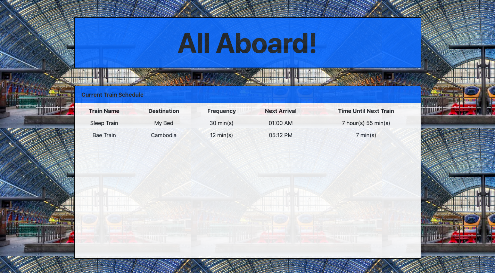
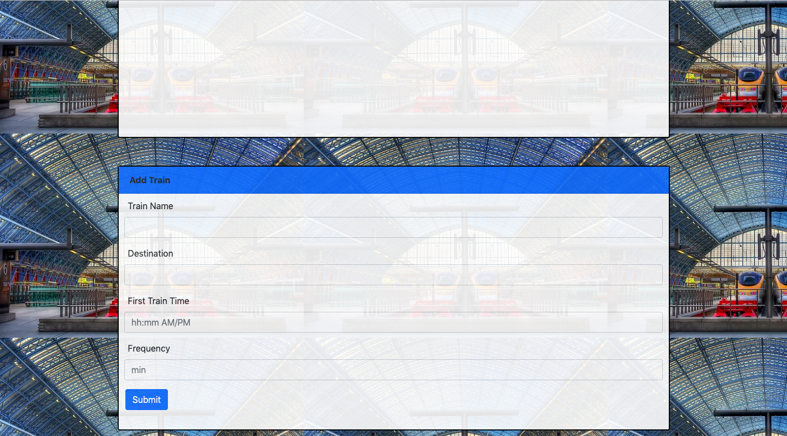

# train-scheduler

## Pictures of Site
Portion to display current train schedule:

Portion for user to input new train:

## Description of Site
[Click here to visit site](https://minori-fh.github.io/train-scheduler/)

A train scheduler for the purpose of:
1. Practicing newly learned skills in Firebase

## Technologies Used
1. HTML 
2. CSS
4. Javascript
5. jQuery
6. Firebase

## Author(s): [Minori Hashimoto](https://github.com/minori-fh)